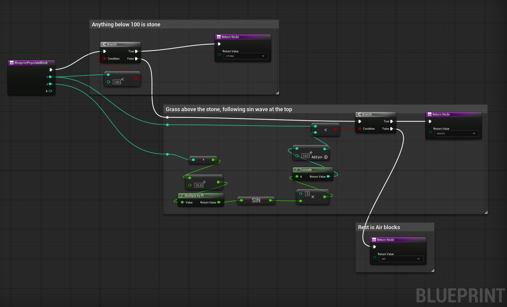

# UE5 Voxel Engine — Technical Prototype

A Minecraft-style voxel rendering and chunk streaming system built in **Unreal Engine 5 C++**. The focus was implementing the hard parts from scratch — procedural mesh generation, face culling, async chunk loading, and real-time voxel editing — without any third-party voxel plugins.


---

## Core systems

**Procedural mesh generation** — chunks are rendered using `UProceduralMeshComponent` with all geometry (vertices, indices, normals, UVs, tangents) computed manually per voxel face in C++. Each chunk is split into 16×16×16 sections (16 tall = 16×16×256 total) for efficient partial rebuilds.

**Neighbor-based face culling** — only faces adjacent to air are emitted, eliminating all interior geometry before it hits the GPU.

**Texture atlas UV mapping** — block types map to sub-regions of a shared atlas via a per-face lookup table, with correct per-direction UV inversion for winding order.

**Async chunk streaming** — mesh generation runs on UE5's thread pool via `Async(EAsyncExecution::ThreadPool, ...)`, returning `TFuture<TArray<MeshData*>>`. Results feed into a `TQueue` and are consumed one per frame on the game thread. In-flight chunks are tracked in a `TMap<int32, TFuture<...>*>` to prevent duplicate generation.

**Real-time voxel editing** — left-click places a block, right-click removes one. A line trace from the camera identifies the target chunk and voxel. The affected section is rebuilt immediately; if the edit falls on a section boundary, the adjacent section is rebuilt too.

**Blueprint-driven world generation** — `BlueprintPopulateBlock(i, j, k)` exposes block population to Blueprints, allowing terrain algorithms to be iterated without recompiling C++. Current terrain: a sine-wave heightmap in the Y direction.



---

## Architecture

```
FPSCharacter (Tick)
  ├── Detects chunk boundary crossing
  ├── PlayerMovedToAnotherChunk() → ThreadPool tasks → TFuture<MeshData>
  └── Dequeues results → AChunk::CreateChunk()

AChunk
  ├── GenerateChunkData()        — block array via Blueprint callback
  ├── GetMeshData()              — face culling, UVs, normals per section
  ├── CreateVoxelChunk()         — uploads to UProceduralMeshComponent
  ├── AddVoxel() / RemoveVoxel() — edits block array, rebuilds section(s)
  └── ChunkMap                   — TMap<int32, AChunk*> spatial hash
```

---

## Known limitations

- **No inter-chunk face culling** — boundary faces are always rendered regardless of neighbor content
- **No chunk unloading** — stubbed; spatial hash cleanup and actor destroy are the next step
- **No load priority** — chunks load in grid iteration order, not by distance to player
- **No greedy meshing** — adjacent same-type faces are not merged
- **Minimal world gen** — sine-wave only; no noise, biomes, or caves

---

## Controls

| Input | Action |
|-------|--------|
| WASD | Move |
| Space | Jump |
| Mouse | Look |
| Left click | Place block |
| Right click | Remove block |
| 1 – 4 | Select block type |